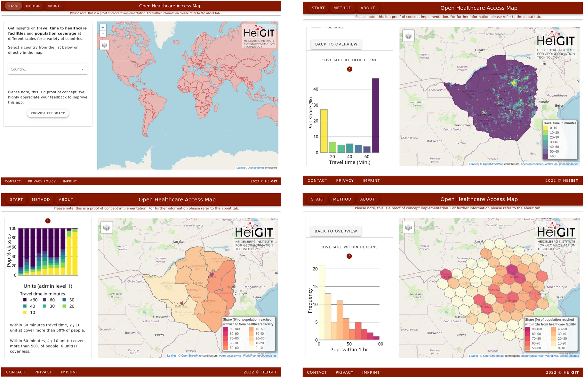

# Accessibility to healthcare

Open Healthcare Access Map 

[https://apps.heigit.org/healthcare_access/#/](https://apps.heigit.org/healthcare_access/#/)

Example Kosovo

[https://apps.heigit.org/healthcare_access/#/countries/xkx](https://apps.heigit.org/healthcare_access/#/countries/xkx/primary/adm0)

* Isochrone based accessibility towards healthcare facilities
* Differentiated by facility type
  - primary care
  - secondary care
* Globally available 
* Different scale per countries:
  - Admin 1, 2
  - Hexagons (ISEA3H level 8)

References:

* Geldsetzer, P.; Reinmuth, M.; Ouma, P. O., Lautenbach, S.; Okiro E. A.; Bärnighausen, T.; Zipf, A. Mapping physical access to health care for older adults in sub-Saharan Africa and implications for the COVID-19 response: a cross-sectional analysis. The Lancet Healthy Longevity. 2020;1(1):e32-e42. [https://doi.org/10.1016/S2666-7568(20)30010-6)](https://doi.org/10.1016/S2666-7568(20)30010-6))
* Petricola, S., Reinmuth, M., Lautenbach, S. et al. Assessing road criticality and loss of healthcare accessibility during floods: the case of Cyclone Idai, Mozambique 2019. Int J Health Geogr 21, 14 (2022). [https://doi.org/10.1186/s12942-022-00315-2](https://doi.org/10.1186/s12942-022-00315-2)
* Klipper, I. G., Zipf, A., and Lautenbach, S.: Flood Impact Assessment on Road Network and Healthcare Access at the example of Jakarta, Indonesia, AGILE GIScience Ser., 2, 4, , 2021. [https://doi.org/10.5194/agile-giss-2-4-2021](https://agile-giss.copernicus.org/articles/2/4/2021/)
* [https://files.osmfoundation.org/s/MfweMaQyzaZiQ4p](https://files.osmfoundation.org/s/MfweMaQyzaZiQ4p)

